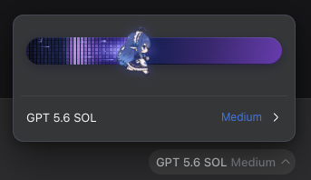

# dsh-reasoning-effort

dsh 思考等级与视觉能力解放插件

1. 手动维护 `models.json`，为常见的模型自动补全 `reasoning_effort`
2. 解锁第三方模型原生的视觉能力
3. 在 Composer 中加入鲸鱼娘推理强度滑块



## 构建

```bash
pnpm install
pnpm run build
pnpm run typecheck
pnpm test
```

## 安装（本地源码）

```bash
cd /absolute/path/to/dsh-reasoning-effort
pnpm install && pnpm run build

# 链接进 web profile。包内 cordis.patch.yml（package.json 的 dsh.bundle 声明）
# 会自动把 providers-reasoning 插件行挂进 profile 层栈，无需手写 patch。
dsh plugin --profile web add link:$PWD
```

## License

MIT。第三方素材（鲸鱼精灵图）的来源与版权声明已并入 [`LICENSE`](./LICENSE)。
